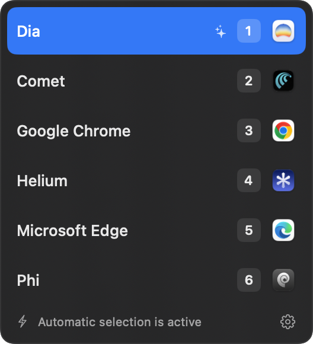

# Reflex

Reflex is a small native macOS app that opens each web link in the browser or browser profile that fits it best.

It can use [TypeSafe Jev](https://www.typesafe.ai/) through OpenRouter for automatic selection. When the result is not clear, Reflex shows a compact chooser and lets you decide.

<p align="center">
  
</p>

## Install with Homebrew

Reflex requires macOS 14 or newer.

```sh
brew install --cask Joker666/tap/reflex
```

After installation:

1. Open Reflex.
2. Make Reflex the default browser for HTTP and HTTPS links.
3. Enable the browsers and profiles that you want to use.
4. Add a short purpose for each target, such as `Work links and company accounts`.
5. Optional: add an OpenRouter API key to enable automatic selection.

You can use Reflex without an API key. In this mode, Reflex shows the chooser for each link.

## Main features

- Includes guided first-launch setup for required access, optional automatic routing, browser discovery, and target purposes.
- Routes links to Safari, Chrome, Dia, Comet, Helium, Edge, Phi, Zen, Firefox, or Brave.
- Supports profiles for recognized Chromium-based browsers.
- Opens the chooser when automatic selection is unavailable or uncertain.
- Configurable auto-route confidence threshold (default 85%) in Settings.
- Lets you hold Option while you click a link to open the chooser directly. You can change this modifier in Settings.
- Keeps incoming links in memory only. Reflex does not keep a link history.

## Current limitations

- Profile discovery supports recognized Chromium-based browsers (Chrome, Edge, Comet, Dia, Helium, and Brave). Safari, Firefox, Zen, and Phi profiles are not available.

## Privacy

Reflex does not save the links that you open. For automatic selection, it removes query values and fragments before it sends the reduced link information, source application, target names, and target purposes to OpenRouter. The selected browser always receives the original link.
